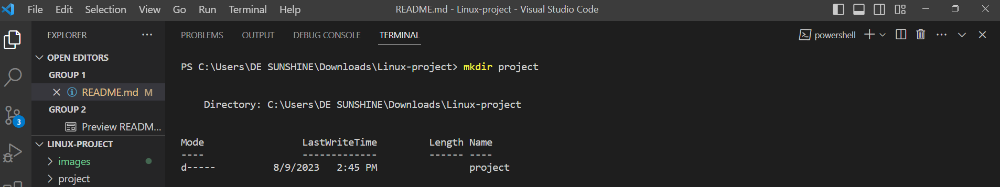

# Linux-project
 
__LINUX COMMANDS__

 <h3>MKDIR</h3>
  mkdir command allows users to create or make new directories.

  #####
  Created a directory named __project__

<h3>CD</h3>

  cd command means __change directory__. It is used to change the current directory of the terminal.
 
  

