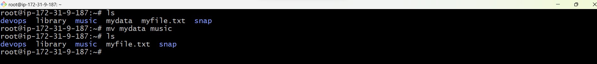

# Linux-project
 
### LINUX COMMANDS

 __MKDIR__ 
 
  __mkdir command__ allows users to create or make new directories.

  
  Create a directory named  __devops__

  `mkdir devops`

__CD__

  __cd__ command means __change directory__. It is used to change the current directory of the terminal.
 
`cd devops`

  

__PWD__

__pwd__ means present working directory.The root directory is represented by the first slash / while the last directory named is your __pwd__.

`pwd`

__LS__

__ls command__ is used to display lists of files and directories in your current working directories.

`ls`

To display hidden files and directories.The files that start with the dot are hidden (.). The current directory (.) as well as the parent directory (..) 

`ls -a`

To display complete information about the files in a long listing format.

`ls -l`

To display File Index Number,for internal purposes you may need to know the index number of a file. 

`ls -i`

To display the latest time a file was created.

`ls -lt`

To sort all the files and directory based on the change of time and lists the newest time in reverse order.

`ls -ltr`

__SUDO__ (super user do)

__sudo__ gives power to a normal user to execute commands which is owned by root user.

`sudo apt update`

`sudo -i`

__CAT__

__cat__ means concatenate. To view the contents of a file.

`cat`

__To view multiple files.__

`cat mydata myfile.txt`

__To create a new file.__

`cat > library`

__CP__

__cp__ means copy.It is used for copying files from one location to another.

`cp myfile.txt library`

_library_ is an empty file so i copied the content in _myfile.txt_ to _library_.

__MV__

__mv__ means move. It moves files and directories from one directory to another.

`mv mydata music`

__renaming a file or directory__

`mv music mymusic`

_renamed music to mymusic_

