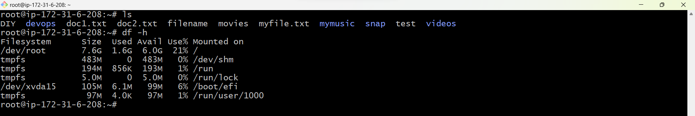
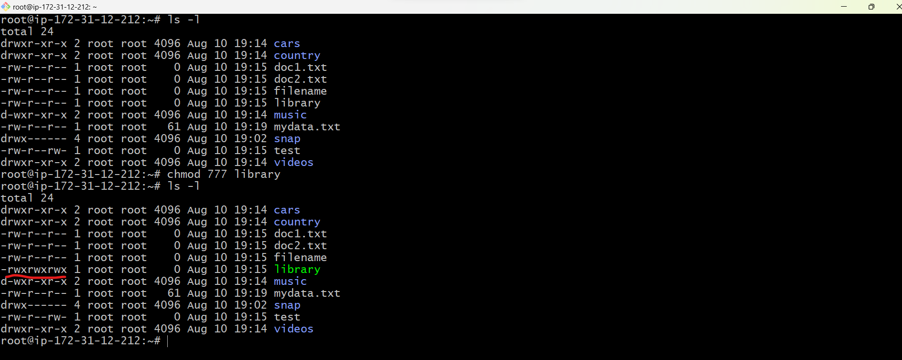
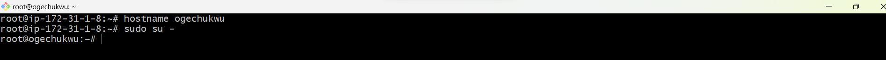
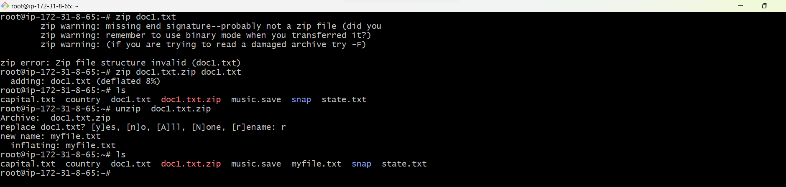

# Linux-project
 
### LINUX COMMANDS

 __MKDIR__ 
 
  __mkdir command__ allows users to create or make new directories.

  
  Create a directory named  __devops__

  `mkdir devops`

__CD__

  __cd__ command means __change directory__. It is used to change the current directory of the terminal.
 
`cd devops`

  

__PWD__

__pwd__ means present working directory.The root directory is represented by the first slash / while the last directory named is your __pwd__.

`pwd`

__LS__

__ls command__ is used to display lists of files and directories in your current working directories.

`ls`

To display hidden files and directories.The files that start with the dot are hidden (.). The current directory (.) as well as the parent directory (..) 

`ls -a`

To display complete information about the files in a long listing format.

`ls -l`

To display File Index Number,for internal purposes you may need to know the index number of a file. 

`ls -i`

To display the latest time a file was created.

`ls -lt`

To sort all the files and directory based on the change of time and lists the newest time in reverse order.

`ls -ltr`

__SUDO__ (super user do)

__sudo__ gives power to a normal user to execute commands which is owned by root user.

`sudo apt update`

`sudo -i`

_to be a root user_

__CAT__

__cat__ means _concatenate_. To view the contents of a file.

`cat`

__To view multiple files.__

`cat mydata myfile.txt`

__To create a new file.__

`cat > library`

__CP__

__cp__ means _copy_.It is used for copying files from one location to another.

`cp myfile.txt library`

_library_ is an empty file so i copied the content in _myfile.txt_ to _library_.

__MV__

__mv__ means _move_. It moves files and directories from one directory to another.

`mv mydata music`

__renaming a file or directory__

`mv music mymusic`

_renamed music to mymusic_

__RMDIR__

__rmdir__ means _remove directory_.The directory must be empty before you can remove it.

`rmdir`

_To remove multiple directories_

`rmdir devops music videos`

__RM__

__rm__ stands for _remove_, and it is used to remove files, and links. 

`rm`

__Touch__

__touch__ is used to create an empty file.

`touch doc1.txt`

_To create multiple files_

`touch doc2.txt test movies`

__LOCATE__

__locate__ is used find the files by name. its useful when you don't know where a file is saved or the name actual name of the file.

`locate -i DIY` 

`locate -i filename`

__FIND__

__find__ It can be used to find files and directories.

`find *.txt`

_find everything ending with .txt_

__GREP__

__grep__ means _global regular expression print_ is used to filter and find something and displays all line that contain the pattern.

`grep -i`

_ignore cases for matching_

`grep -i "music" *`    

_To list the files where music appears_

`grep -l "music` *

__DF__

__df__ means _disc free_, is used to display the free disc space of a specific file system.

`df`

_if you specify a particular file, then it will show the information of that particular file_.

`df filename`

_Prints sizes in a human-readable format_

`df -h`

__DU__ 

__du__ means disk usage, to check how much space a file or a directory takes.

`du -a`

 _To display all files, including directories, with their sizes_

 

 __HEAD__

 __head__ to print the first line of any file. By default it shows 10 lines.

 `head DIY`

 

 _to print the number of your choice_

 `head -n 5 DIY`

 

 

__TAIL__

__tail__ prints the last ten lines of a text in a file.

`tail DIY`

__DIFF__

__diff__ stands for difference.it is used to display the differences in the files by comparing the files line by line

`diff`

__TAR__

__tar__ stands for Tape Archive and is used to create and extract archive files. Archive means a way to have our files stored in a historical manner.

__CHMOD__

__chmod__ stands for _change mode_. Which states that every file and directory has a set of permissions that control the permissions like who can read, write or execute the file.

`chmod o+w test`

_give __others__, __write__ permission_

`chmod u-r test`

_remove __read__ permission from __user___

_give full permission with numbers_

`chmod 777 library`

 
 __CHOWN__

 __chown__ stands for _change ownership_, is used to change the user ownership. 

 `chown rap music`

 

 __JOBS__

 __jobs__ used to list the jobs that you are running in the background and in the foreground.

 `jobs`

 

 __KILL__

 __kill__  is a built-in command which is used to terminate processes manually.

`kill -l`

__PING__

__ping__ Packet Internet Groper.Is mainly used for checking the network connectivity among host/server and host.

`ping -V`  _to install ping_

`ping www.darey.io` _to start ping_

`ping -c 3 www.darey.io` _define the number of packets to send to the server/host_

`ping -i 2 www.daery.io` _the ping interval will change to 2 seconds_

__WGET__

__wget__ stands for web get. Its a free non-interactive file downloader command. Meaning it can work in background when user is not logged in without hindering the current process.It supports HTTP, HTTPS, and FTP protocol.

`wget http://example.com/sample.php`

__UNAME__

__uname__ prints information about the system in the following order: Kernel name, network node hostname, kernel release date, kernel version, machine hardware name, hardware platform, operating system.

`uname`

__TOP__

__top__ used to show the active Linux processes.

`top`

__HISTORY__

__history__  list all the commands you have executed.

`history`

__MAN__

__man__ used to display the user manual of any command that we can run on the terminal. It provides a detailed view of the command use as help.whenever you need help with any command just consult the __man__.

`man cp`

__ECHO__

__echo__ whatever you give echo, it prints back the message.

`echo "i believe in GOD"`

`echo` 

-e here enables the interpretation of backslash escapes 

\b : it removes all the spaces in between the text

\n : this option creates a new line from where it is used.

 \t : this option is used to create horizontal tab spaces.

  \v : this option is used to create vertical tab spaces.

  *: this command will print all files/folders, similar to ls command.

  

__HOSTNAME__

__hostname__  is a name given to a computer and attached to the network.

`hostname ogechukwu`

__USERADD__ and __USERDEL__

__useradd__  is used for creating a new user.

__userdel__ is used to delete a user account and related files.

`useradd Ogechukwu`

`userdel Ogechukwu`

__APT-GET__

__apt-get__  a command-line tool that helps in handling packages in Linux.APT stands for Advanced Packaging Tool. It is a Debian-based Linux operating system, for example, Ubuntu and Debian itself. 

`apt-get`

__NANO, VI, JED__

__nano, vi, jed__ are text editors used to create and open a new file.

`nano`

`vi`

__SU__

__su__ stands for _switch user_,allows a user to switch to another user account and gain all the privileges.

`su ebere`

__HTOP__

__htop__ stands for human readable top,  also prints full command lines for processes and allows one to scroll both vertically and horizontally for processes and command lines.

`htop`

`htop --v` _version information_

__PS__

__ps__ stands for _process status_, used to list the currently running processes and their PIDs along with some other information depends on different options.

`ps, ps -a`

__WC__

__wc__ _stands for word count_, it will count the number of lines,words,byte size and name of the file.

`wc -w` _to count only words_.

`wc -l` _to count only lines_.

`wc -c` _to count only byte size_.

__ID__

__id__ is used to 

find User name and real user id.

Find out the specific Users UID.

Show the UID and all groups associated with a user.

List out all the groups a user belongs to.

`id -u china` _to find out UID_

`id -g joy` _to find the GID_

`id -nu master` _to display name instead of number_

__ZIP and UNZIP__

__zip__ is used to compress files to reduce file size.

__unzip__ will list, test, or extract files from a ZIP archive.

`zip`

`unzip`

__TAR__

__tar__ stands for tape archive, which is used to create Archive and extract the Archive files. 

`tar -cvf mymusic.tar country` _to create a new tar file_.

`tar -tvf mymusic.tar country` _to see the file you created_.

`tar -xvf mymusic.tar country` _to get back all the file._

 
 

